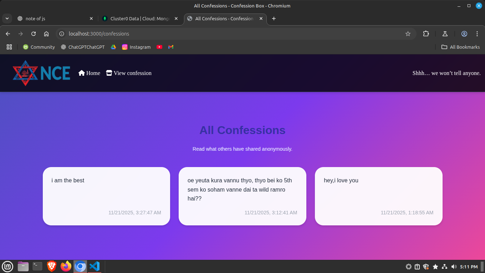
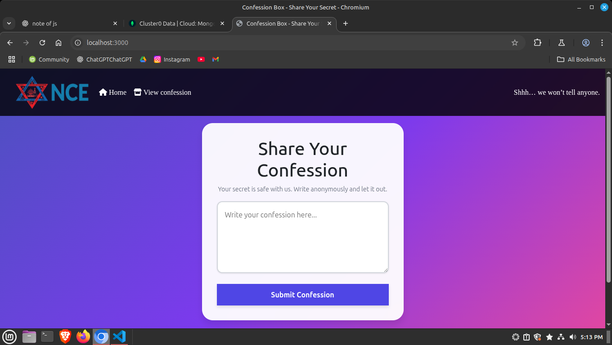

🕊️ Confession Box – Share Your Secret
    A simple and anonymous confession-sharing website built using Node.js, Express, MongoDB Atlas & EJS.

    Users can write confessions anonymously, and view what others have shared. Fully responsive and clean modern UI.

🚀 Features:
    📝 Post anonymous confessions

    📄 View all confessions from database

    ☁️ Connected to MongoDB Atlas

    🎨 Beautiful UI with gradient theme

    📱 Fully responsive

    ⚡ Fast & lightweight

    🔒 Secure data handling

🛠️ Tech Stack
    Frontend:

        HTML

        CSS

        Bootstrap

        EJS templating

    Backend:

        Node.js

        Express.js

        MongoDB Atlas

        Mongoose ORM

📂 Project Structure
confession-box/
│
├── models/
│   └── confessionModel.js
│
├── routes/
│   └── confessionRoutes.js
│
├── views/
│   ├── home.ejs
│   ├── confessions.ejs
│   └── partials/
│
├── public/
│   ├── css/
│   └── images/
│
├── server.js
├── package.json
└── README.md

1️⃣ Clone the repo
git clone https://github.com/your-username/confession-box.git

2️⃣ Install dependencies
cd confession-box
npm install

3️⃣ Add your MongoDB Atlas URI
In server.js:
mongoose.connect("your-mongodb-connection-string-here")

4️⃣ Run the server
node server.js

5️⃣ Visit in browser
http://localhost:3000

📸 Screenshots

